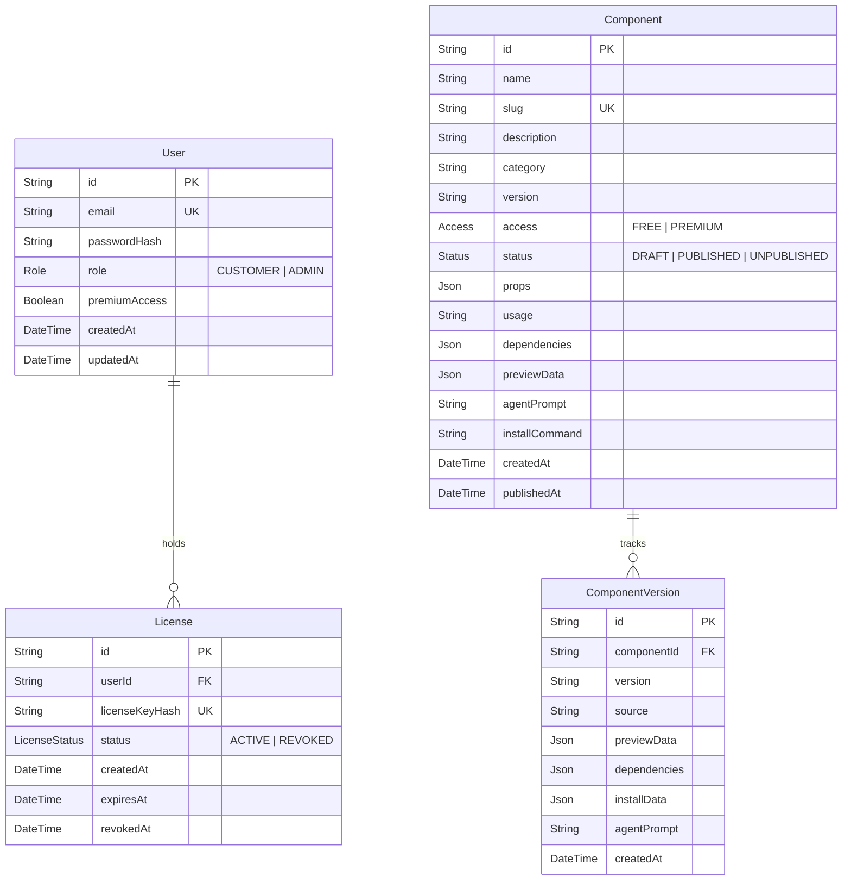

# Tech Inject Design Library

A production-ready monorepo platform for discovering, managing, inspecting, and installing high-performance reusable React + TypeScript components.

Tech Inject Design Library combines:
- **Public Component Catalogue** (`apps/catalogue` on port 3000): Developer documentation, interactive component sandboxes, props tables, copy-to-clipboard code, and AI coding agent prompts.
- **Admin Management Portal** (`apps/admin` on port 3002): Dashboard metrics, component versioning, constrained bundle uploads, schema validation, publication state controls, and customer premium license issuance/revocation.
- **Backend API & Data Engine** (`apps/api` on port 3001): Next.js Route Handlers powered by Prisma ORM and PostgreSQL inside Docker Compose, enforcing JWT authentication, server-side premium validation, and SHA-256 hashed license verification.
- **CLI Installer** (`cli/`): Scaffolds components directly into consumer React/Next.js projects (`npx tech-inject add <slug>`) with path-traversal safeguards and overwrite protection.
- **Shared Monorepo Packages** (`packages/*`): Domain contracts (`@tech-inject/types`), Zod runtime schemas (`@tech-inject/validation`), and the design system component library (`@tech-inject/ui`).

---

## 1. Architecture & Monorepo Structure

```
tech-inject-design-library/
│
├── apps/
│   ├── catalogue/             # Public component catalogue (Next.js 14 App Router, port 3000)
│   │   ├── app/               # Catalogue pages: /, /components, /components/[slug], /get-started, /login, /account
│   │   ├── components/        # Client header & navigation wrappers
│   │   ├── lib/               # Typed client-side API bridge
│   │   └── package.json
│   │
│   ├── admin/                 # Administrator portal (Next.js 14 App Router, port 3002)
│   │   ├── app/               # Admin pages: /dashboard, /components, /components/new, /components/[id]/edit, /customers
│   │   ├── components/        # Protected admin sidebar & topbar wrappers
│   │   ├── lib/               # Typed administrator API bridge
│   │   └── package.json
│   │
│   └── api/                   # Core Backend REST API (Next.js 14 Route Handlers, port 3001)
│       ├── app/api/           # REST endpoints (/auth, /components, /admin)
│       ├── lib/               # Business logic, Prisma client, JWT, license hashing, auth guards
│       ├── next.config.js     # Global CORS and preflight headers
│       └── package.json
│
├── packages/
│   ├── types/                 # Shared TypeScript models and DTO interfaces (@tech-inject/types)
│   ├── validation/            # Zod schemas for runtime payload validation (@tech-inject/validation)
│   └── ui/                    # Design system components, tokens & preview renderer (@tech-inject/ui)
│
├── prisma/
│   ├── schema.prisma          # PostgreSQL relational data model
│   └── seed.ts                # Database seed script for test accounts & components
│
├── cli/
│   ├── src/index.ts           # CLI executable script (npx tech-inject add <slug>)
│   ├── tsconfig.json
│   └── package.json
│
├── tests/
│   └── platform.test.ts       # 16-point automated test suite covering all security & functional criteria
│
├── docker-compose.yml         # Containerized PostgreSQL 16 database definition
├── .env.example               # Template environment configuration
├── .env                       # Local development environment configuration
├── .gitignore
├── vitest.config.ts           # Vitest configuration with path aliases
├── README.md                  # Comprehensive documentation
├── answers.md                 # Architectural & security rationale
└── package.json               # Root npm workspace configuration
```

---

## 2. Prerequisites & Local Environment

- **Node.js**: v18.17.0+ or v20.x+ (tested on Node v22.12.0)
- **npm**: v9.x+ (tested on npm 11.18.0)
- **Docker & Docker Compose**: Docker Desktop with Compose v2+ installed and running.

---

## 3. Quick Start & Docker Setup

### Step 1: Start PostgreSQL via Docker Compose
From the repository root, start the isolated PostgreSQL container:
```bash
docker compose up -d
```
To verify the container is healthy and listening on port 5432:
```bash
docker ps
```
*(To stop the container later: `docker compose down`)*

### Step 2: Install Monorepo Dependencies
```bash
npm install
```

### Step 3: Initialize Database Schema with Prisma
Generate the Prisma Client and synchronize the PostgreSQL database:
```bash
npx prisma generate
npx prisma db push
```

### Step 4: Seed Database with Initial Data
Run the idempotent seed script to create test users, licenses, and components:
```bash
npm run seed
```

### Step 5: Start the Applications
Start the three applications in separate terminals:

```bash
# Terminal 1: Backend API (port 3001)
npm run dev:api

# Terminal 2: Public Catalogue (port 3000)
npm run dev:catalogue

# Terminal 3: Admin Dashboard (port 3002)
npm run dev:admin
```

Navigate to:
- Public Catalogue: [http://localhost:3000](http://localhost:3000)
- Admin Dashboard: [http://localhost:3002](http://localhost:3002)
- Backend API: [http://localhost:3001/api/components](http://localhost:3001/api/components)

---

## 4. Pre-seeded Test Accounts

The seed script creates three accounts with well-defined roles and permissions:

| Email | Password | Role | Premium Access | Active License Key |
| :--- | :--- | :--- | :--- | :--- |
| `admin@example.com` | `Admin123!` | `ADMIN` | Granted (`true`) | Full administrator privileges |
| `premium@example.com` | `Customer123!` | `CUSTOMER` | Granted (`true`) | `TI-PRO-DEV1-SEED-PREM-2026` |
| `free@example.com` | `Customer123!` | `CUSTOMER` | Standard (`false`) | None |

---

## 5. Database Schema & Data Models

The Prisma schema defines four core models:



---

## 6. Security Architecture

### A. Authentication
- Passwords hashed using `bcrypt` (10 rounds). Plaintext passwords are never logged or stored.
- Session tokens are signed JWTs (`jsonwebtoken`) containing only `{ userId, role }`. No sensitive credentials, hashes, or code are stored in the token.
- Tokens are transmitted via HTTP-only cookies (`auth_token`) with `sameSite: 'lax'` and `path: '/'`. API requests also support the standard `Authorization: Bearer <token>` header.

### B. Server-Side Premium Authorization
- **Zero Frontend Trust**: Frontend booleans (`isPremium = true`) are never trusted.
- Every protected endpoint (`/api/components/:slug/source`, `/api/components/:slug/preview`, `/api/components/:slug/install`, `/api/components/:slug/agent-prompt`) evaluates access server-side.
- If access is revoked by an administrator while a user session is active, the database is queried live, and the immediate next request fails with `403 Forbidden`.

### C. License Key Generation & Cryptographic Hashing
- License keys are generated in the format `TI-PRO-XXXX-XXXX-XXXX-XXXX` using cryptographically secure random bytes (`crypto.randomBytes`).
- The raw license key is **never stored in the database**. It is hashed using HMAC-SHA256 with the server's `LICENSE_SECRET`.
- When an administrator grants premium access, the raw key is returned in the response **exactly once**.
- When a customer submits a key via `POST /api/auth/verify-license`, the server hashes the input, compares it against active records, validates expiration, and links the entitlement.

### D. Component Upload & Preview Isolation
- Component uploads are strictly constrained to structured JSON bundles validated by Zod (`componentBundleSchema`).
- The backend never evaluates, runs `eval()`, or executes uploaded source code in Node.js.
- Previews are rendered using safe declarative configurations (`LivePreviewRenderer`) or restricted sandboxed iframes. Uploaded code has no access to environment secrets, database credentials, or server filesystems.

---

## 7. API Reference

### Authentication
- `POST /api/auth/login`: Authenticate with `{ email, password }`. Sets HTTP-only cookie and returns JWT.
- `POST /api/auth/logout`: Clears session cookie.
- `GET /api/auth/me`: Returns sanitized user profile `{ id, email, role, premiumAccess }`.
- `POST /api/auth/verify-license`: Verifies `{ licenseKey }` against hashed licenses and activates premium status.

### Public Components
- `GET /api/components`: Returns public metadata for all `PUBLISHED` components. Excludes drafts and unpublished items.
- `GET /api/components/:slug`: Returns component metadata. For `PREMIUM` components without active entitlements, source and private preview payloads are omitted and locked.

### Protected Component Endpoints
*(Permitted for FREE components, or PREMIUM components with active user entitlement)*
- `GET /api/components/:slug/source`: Returns full TypeScript source and package dependencies.
- `GET /api/components/:slug/preview`: Returns live preview mock data and prop bindings.
- `GET /api/components/:slug/install`: Returns the file payload consumed by the CLI.
- `GET /api/components/:slug/agent-prompt`: Returns the AI coding agent specification prompt.

### Administrator Endpoints *(Requires ADMIN role)*
- `GET /api/admin/stats`: Dashboard summary counts.
- `GET /api/admin/components`: Lists all components (drafts, published, unpublished) and version histories.
- `POST /api/admin/components`: Creates a new component draft or publishes directly.
- `GET /api/admin/components/:id`: Retrieves full component details.
- `PATCH /api/admin/components/:id`: Updates component metadata or creates a new version.
- `DELETE /api/admin/components/:id`: Deletes a component.
- `POST /api/admin/components/:id/validate`: Runs schema and integrity checks.
- `POST /api/admin/components/:id/publish`: Transitions status to `PUBLISHED`.
- `POST /api/admin/components/:id/unpublish`: Transitions status to `UNPUBLISHED`.
- `GET /api/admin/customers`: Lists all registered users and their license audit logs.
- `GET /api/admin/customers/:id`: Retrieves customer details.
- `POST /api/admin/customers/:id/grant-premium`: Generates a random key, hashes it, stores license, and returns raw key once.
- `POST /api/admin/customers/:id/revoke-premium`: Marks active licenses as `REVOKED` and sets `premiumAccess = false`.

---

## 8. CLI Component Installer

The CLI enables developers to pull components directly into their local project tree.

### Installation Command
```bash
npx tech-inject add <component-slug>
```

### Options & Flags
- `-a, --api <url>`: Target API URL (default: `process.env.TECH_INJECT_API_URL` or `http://localhost:3001`)
- `-l, --license <key>`: Active license key for premium components (`TI-PRO-XXXX-...`)
- `-t, --token <jwt>`: Customer JWT session token
- `-p, --path <dir>`: Target directory relative to project root (default: `components`)
- `-o, --overwrite`: Allow overwriting existing files (default: `false`)

### Example Usage
```bash
# Install a free component into default ./components/ directory
npx tech-inject add modern-button

# Install a premium component using an active license
npx tech-inject add stat-metric-card --license TI-PRO-DEV1-SEED-PREM-2026

# Install into a custom directory with overwrite permission
npx tech-inject add glass-card --path src/ui --overwrite
```

### CLI Security Safeguards
1. **Path Traversal Protection**: Rejects paths containing `..` or absolute paths attempting to write outside the project root.
2. **Overwrite Guard**: Checks `fs.existsSync()`. Aborts with an informative error if a file exists, preventing accidental code destruction.
3. **No Shell Execution**: The CLI does not execute arbitrary shell scripts or lifecycle hooks supplied by components.

---

## 9. AI Coding Agent Workflow

Every component includes an AI prompt crafted for LLM coding agents (Cursor, Claude Code, Antigravity).

To use:
1. Open any component page in the public catalogue (`/components/[slug]`).
2. Click the **AI Agent Prompt** tab.
3. Click **Copy AI Prompt**.
4. Paste the prompt directly into your agent conversation. The prompt specifies:
   - Target filename (`components/<slug>.tsx`)
   - Exact prop interfaces and default values
   - Required npm dependencies (e.g. `lucide-react`)
   - Tailwind design system styling constraints
   - Functional verification and test instructions

---

## 10. Verification & Test Suite

The automated test suite verifies 16 critical functional and security criteria:

```bash
npm test
```

### Verified Test Matrix:
1. `Admin authentication generates valid token and verifies ADMIN role`
2. `Customer login verifies password and returns CUSTOMER role`
3. `Invalid login with incorrect password fails authentication`
4. `Draft components cannot be accessed publicly`
5. `Published component can be accessed publicly`
6. `Unpublished component cannot be accessed publicly`
7. `Invalid upload bundle is rejected by validation schema`
8. `Free component source and install payload are accessible`
9. `Premium component is blocked for free user`
10. `Premium component is accessible for authorized premium user`
11. `Revoked premium access is denied server-side`
12. `Customer cannot grant themselves premium access`
13. `Customer is forbidden from admin API actions`
14. `Unsafe installer paths with path traversal are rejected`
15. `CLI refuses to silently overwrite existing files without overwrite flag`
16. `Source and metadata correspond precisely to published ComponentVersion`

---

## 11. Production Deployment Guide

- **Public Catalogue & Admin Dashboard**: Deployable to Vercel or AWS Amplify as standard Next.js applications. Configure `NEXT_PUBLIC_API_URL` to point to the deployed API origin.
- **Backend API**: Deployable as Next.js route handlers or standalone Node.js container (e.g. Cloud Run, Render, ECS).
- **PostgreSQL**: In production, use a managed database (Neon, Supabase, AWS RDS, Cloud SQL). Set `DATABASE_URL` in the API environment. Do not use local Docker containers for production deployments.

---

## 12. Known Limitations & Recovery Plan

1. **Preview Sandboxing Limitation**: Declarative preview rendering prevents remote arbitrary code execution. Complex third-party binary canvas components should be previewed inside sandboxed iframes without `allow-same-origin`.
2. **Database Recovery Plan**: In the event of schema drifts or connection interruptions, run `npx prisma db push` to reconcile PostgreSQL state, followed by `npm run seed` to re-establish test baselines.
